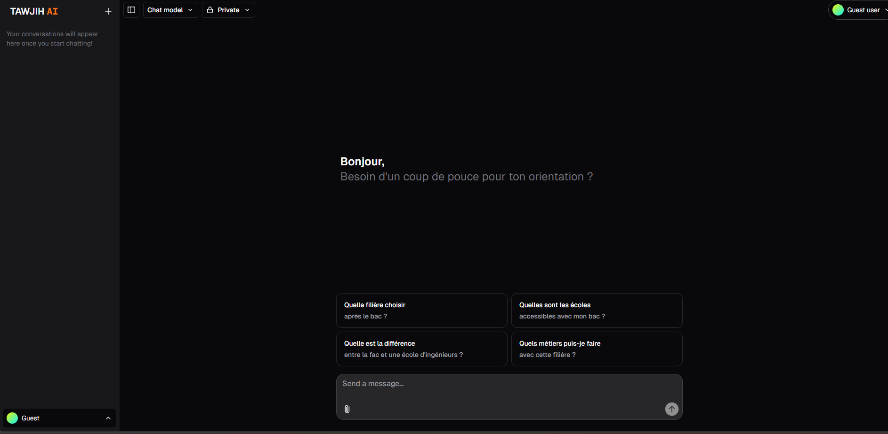
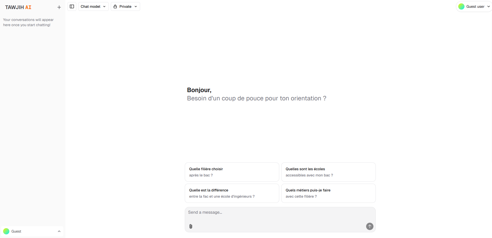

<a href="https://nextjs-ai-chatbot-six-rouge-59.vercel.app/">
  
  
  <h1 align="center">TAWJIH AI</h1>
</a>

    <strong>TAWJIH AI</strong> est un chatbot intelligent, open-source et gratuit, conçu pour accompagner les étudiants marocains dans leur orientation académique et professionnelle.

 

## 🎓 Objectif de l'application

TAWJIH AI aide les lycéens et étudiants marocains à :
- Découvrir les différentes filières d'études (fac, écoles, prépas, BTS…)
- Comprendre les débouchés des formations (local et international)
- Comparer les écoles et universités marocaines
- Obtenir des conseils personnalisés selon leurs notes, préférences et objectifs
- Préparer les concours ou tests requis

## 🌐 Fournisseurs de modèles

Par défaut, le modèle utilisé est [xAI Grok](https://x.ai). Grâce à l'[AI SDK](https://sdk.vercel.ai/docs), vous pouvez basculer vers :
- [OpenAI (ChatGPT)](https://openai.com)
- [Anthropic (Claude)](https://anthropic.com)
- [Cohere](https://cohere.com)
- et d'autres modèles compatibles via [AI SDK Providers](https://sdk.vercel.ai/providers/ai-sdk-providers)

## 💻 Exécuter en local

Utilisez les variables d'environnement décrites dans le fichier [`.env.example`](.env.example). Idéalement, configurez-les dans Vercel, mais un fichier `.env` suffit pour le développement local.

